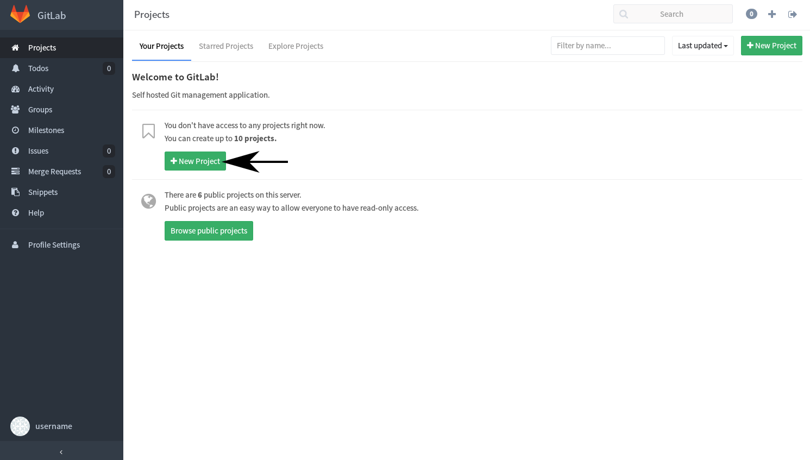
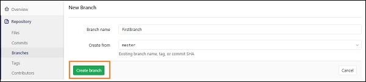
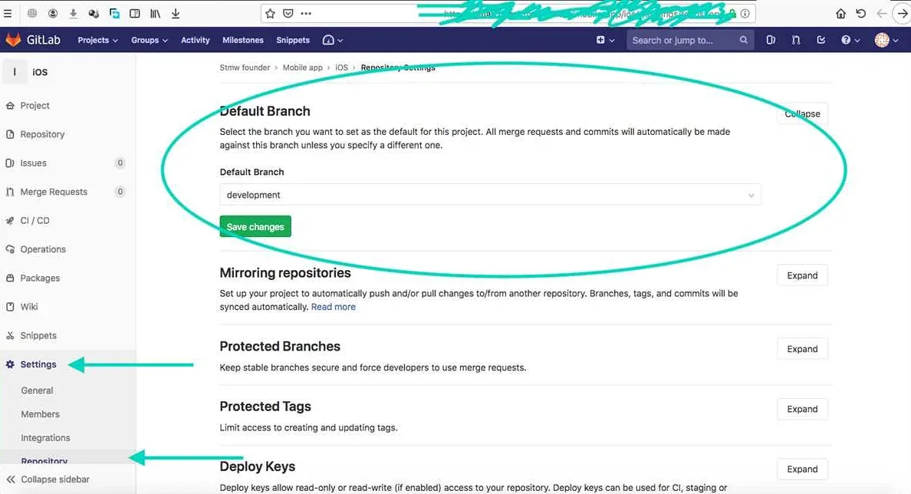
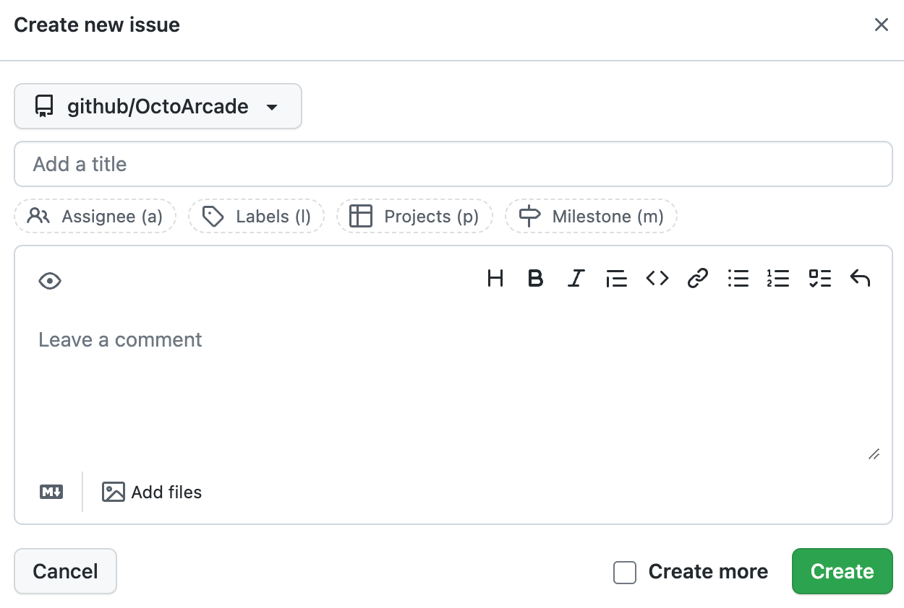
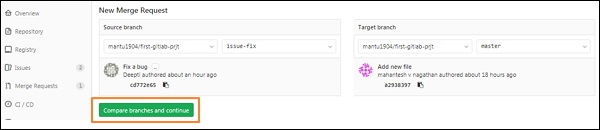

# GitLab Manual

Этот мануал поможет вам освоить базовые операции в GitLab.

## 1. Создание личного репозитория

1. Перейдите на главную страницу GitLab и нажмите **New project**.
2. Выберите **Create blank project**.
3. Укажите имя проекта, видимость и нажмите **Create project**.
4. Добавьте `.gitignore` (например, для Python) и `README.md` через интерфейс GitLab.

## 2. Создание веток `develop` и `master`

1. Перейдите в раздел **Repository > Branches**.
2. Нажмите **New branch**.
3. Создайте ветку `develop` из ветки `master`.

## 3. Установка ветки `develop` по умолчанию

1. Перейдите в **Settings > Repository**.
2. В разделе **Default branch** выберите `develop`.
3. Сохраните изменения.

## 4. Создание issue на создание мануала

1. Перейдите в раздел **Issues** и нажмите **New issue**.
2. Укажите заголовок, например, "Создать мануал по GitLab".
3. Назначьте задачу себе или другому участнику.

## 5. Создание ветки по issue

1. Откройте созданное issue.
2. Нажмите **Create merge request** или создайте ветку вручную через **Repository > Branches**.

## 6. Создание merge request в `develop`

1. Перейдите в раздел **Merge Requests** и нажмите **New merge request**.
2. Выберите исходную ветку (например, `feature/manual`) и целевую (`develop`).
3. Нажмите **Compare branches and continue**.

## 7. Комментирование и принятие реквеста

1. Откройте merge request.
2. Добавьте комментарии, если необходимо.
3. Нажмите **Merge** для принятия изменений.

## 8. Формирование стабильной версии в `master` с тегом

1. Переключитесь на ветку `master`.
2. Создайте merge request из `develop` в `master`.
3. После принятия изменений создайте тег через **Repository > Tags > New tag**.

## 9. Работа с wiki проекта

1. Перейдите в раздел **Wiki**.
2. Нажмите **New page** для создания новой страницы.
3. Используйте Markdown для оформления.

---

Этот мануал охватывает основные этапы работы с GitLab. Для более детальной информации обратитесь к [официальной документации](https://docs.gitlab.com/).